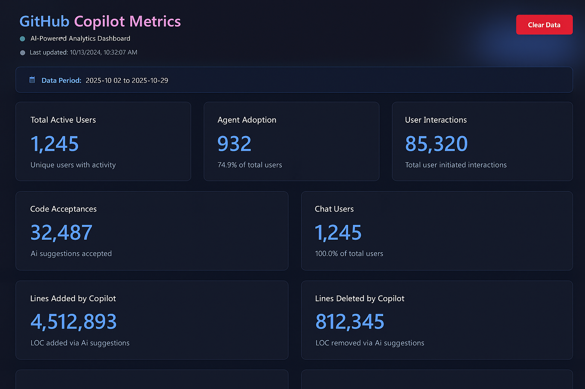

<div align="center">

# GitHub Copilot Insights

A modern analytics dashboard for visualizing GitHub Copilot adoption metrics and AI-assisted development insights. Built with React and designed with a futuristic dark theme featuring glassmorphism effects.

[](LICENSE)

[](https://reactjs.org/)
[](https://vitejs.dev/)

[Features](#features) • [Getting Started](#getting-started) • [Deployment](#deployment) • [Usage](#usage) • [Architecture](#architecture)



</div>

---

## Overview

GitHub Copilot Insights helps organizations understand and optimize their AI-assisted development adoption. Upload your GitHub Copilot usage metrics and instantly visualize comprehensive analytics including user adoption patterns, code acceptance rates, AI model performance, and programming language distributions.

This application can run entirely client-side with browser localStorage, or be deployed with server-side persistence for enterprise environments. All data processing happens locally—no external services or data transmission required.

## Features

### 📊 Comprehensive Analytics Dashboard

**Adoption Metrics**
- Total active users with Agent and Chat breakdowns
- User interaction counts and engagement trends
- Feature adoption rates across your organization
- Lines of code generated and accepted by Copilot

**Time-Series Visualizations**
- Daily and weekly active user trends
- Average chat requests per user over time
- Historical engagement patterns

**AI Model Analytics**
- Compare performance across different AI models (GPT-4o, Claude Sonnet, etc.)
- Model-specific acceptance rates with color-coded indicators
- Interaction volume and code generation metrics per model
- Chat model usage distribution across different chat modes

**Language & IDE Insights**
- Top programming languages by code generation volume
- Language-specific acceptance rates
- IDE distribution and usage patterns
- Feature utilization breakdown

### 👥 Advanced User Table

- Real-time search and filtering by username, IDE, and feature usage
- Sortable columns for all metrics
- Individual user acceptance rates and LOC contributions
- Filter by Agent Only, Chat Only, or both feature sets
- Color-coded metrics for quick visual scanning

### 💾 Flexible Data Persistence

- **Client-side**: Browser localStorage for instant setup
- **Server-side**: Optional Node.js API with persistent storage
- **Kubernetes-ready**: Full deployment manifests for AKS/EKS
- Data survives browser refreshes and can be shared across users

### 🎨 Modern Design System

- Glassmorphism UI with translucent panels and backdrop blur
- Futuristic dark theme with gradient accents
- Smooth animations and hover effects
- Fully responsive layout for all screen sizes
- Custom-styled scrollbars and components

## Getting Started

### Prerequisites

- [Node.js](https://nodejs.org/) 18 or higher
- npm or yarn package manager
- GitHub Copilot usage metrics in NDJSON format

### Local Development

1. **Clone the repository**
   ```bash
   git clone https://github.com/YoavLax/GitHub-Copilot-Insights.git
   cd GitHub-Copilot-Insights
   ```

2. **Install dependencies**
   ```bash
   npm install
   ```

3. **Start the development server**
   ```bash
   npm run dev
   ```

4. **Open your browser**
   
   Navigate to `http://localhost:5173`

The application will run in client-side mode using browser localStorage by default.

### Running with Backend API (Optional)

To enable server-side persistence:

1. **Start the API server**
   ```bash
   cd server
   npm install
   npm start
   ```

2. **In a separate terminal, start the frontend**
   ```bash
   npm run dev
   ```

The frontend will automatically proxy API requests to `http://localhost:8080`.

### Build for Production

```bash
npm run build
npm run preview
```

The optimized build will be available in the `dist/` folder.

## Deployment

### Docker Deployment

**Frontend only (client-side):**
```bash
docker build -t copilot-insights:latest .
docker run -p 8080:8080 copilot-insights:latest
```

**With backend API:**
```bash
# Build API server
cd server
docker build -t copilot-insights-api:latest .

# Build frontend
cd ..
# Update nginx.conf proxy_pass URL to match your API service URL if needed
docker build -t copilot-insights:latest .

# Run both containers
docker run -d -p 3001:3001 copilot-insights-api:latest
docker run -d -p 8080:8080 copilot-insights:latest
```

### Kubernetes Deployment

Full deployment manifests are provided for Kubernetes environments (AKS, EKS, GKE).

```bash
# Deploy frontend
kubectl apply -f k8s/deployment.yaml
kubectl apply -f k8s/service.yaml
kubectl apply -f k8s/ingress.yaml

# Optional: Deploy API server with persistence
kubectl apply -f k8s/api-deployment.yaml
kubectl apply -f k8s/api-service.yaml
```

See [DEPLOYMENT.md](DEPLOYMENT.md) for detailed Kubernetes deployment instructions and [SERVER-PERSISTENCE.md](SERVER-PERSISTENCE.md) for backend API setup.

## Usage

### 1. Export GitHub Copilot Metrics

From your GitHub Enterprise account:
1. Navigate to **Settings** > **Copilot** > **Usage Metrics**
2. Select your desired date range
3. Export data in **NDJSON format**

> [!NOTE]
> See [GitHub's Copilot Usage Metrics documentation](https://docs.github.com/en/enterprise-cloud@latest/copilot/reference/copilot-usage-metrics) for detailed field definitions.

### 2. Upload Your Data

- **Drag and drop** your NDJSON file onto the upload area, or
- **Click to browse** and select your metrics file

The application instantly processes and visualizes your data.

### 3. Explore Insights

- **Summary Dashboard**: Overview cards with key metrics
- **Time-Series Charts**: Track trends over time
- **Model Analytics**: Compare AI model performance
- **Chat Model Insights**: Analyze chat feature usage by model
- **Language Distribution**: See top programming languages
- **User Table**: Drill down into individual user metrics

### 4. Update or Clear Data

- **Upload New File**: Replace current data with fresh metrics
- **Clear Data**: Remove all cached data and start fresh

## Architecture

### Frontend (React SPA)

```
src/
├── components/
│   ├── FileUpload.jsx                    # Drag-and-drop NDJSON upload
│   ├── SummaryDashboard.jsx              # Metric cards and overview
│   ├── UserTable.jsx                     # Sortable user metrics table
│   ├── ChatModelCharts.jsx               # Chat model usage analytics
│   ├── DailyActiveUsersChart.jsx         # DAU trend visualization
│   ├── WeeklyActiveUsersChart.jsx        # WAU trend visualization
│   ├── AverageChatRequestsChart.jsx      # Chat activity trends
│   ├── LanguagePieChart.jsx              # Programming language distribution
│   ├── FeatureBarChart.jsx               # Feature adoption breakdown
│   ├── IdeBarChart.jsx                   # IDE usage metrics
│   ├── ModelBarChart.jsx                 # AI model comparison
│   ├── ModelAcceptanceRateChart.jsx      # Model acceptance rates
│   └── LanguageAcceptanceRateChart.jsx   # Language acceptance rates
├── utils/
│   ├── dataProcessor.js                  # NDJSON parsing and aggregation
│   └── api.js                            # API client (when backend enabled)
├── App.jsx                               # Main application component
└── main.jsx                              # React entry point
```

### Backend API (Optional)

```
server/
├── server.js                             # Express API server
├── package.json                          # API dependencies
└── Dockerfile                            # API container image

Endpoints:
- POST /api/upload    - Upload metrics file
- GET  /api/metrics   - Retrieve stored metrics
- DELETE /api/metrics - Clear all data
- GET  /health        - Health check
```

### Tech Stack

| Technology | Purpose |
|------------|---------|
| React 18 | UI framework with modern hooks |
| Vite 5 | Build tool and dev server |
| Tailwind CSS 3 | Utility-first styling |
| Chart.js 4 | Data visualization |
| Recharts 2 | Additional chart components |
| Express 4 | Backend API (optional) |
| Nginx | Production web server |

## Key Metrics Explained

| Metric | Description |
|--------|-------------|
| **Active Users** | Users with any Copilot interaction |
| **Agent Adoption** | Percentage using Copilot Agent features |
| **Chat Users** | Users who engaged with Copilot Chat |
| **Acceptance Rate** | (Acceptances ÷ Generations) × 100 |
| **LOC Added** | Lines of code added by Copilot |
| **DAU** | Daily Active Users (unique per day) |
| **WAU** | Weekly Active Users (unique per week) |

## Privacy & Security

- **No external data transmission** - All processing happens locally
- **No analytics or tracking** - Zero telemetry
- **Client-side capable** - No backend required
- **Open source** - Full code transparency
- **Kubernetes security** - Non-root containers, dropped capabilities
- **localStorage only** - Data stays in your browser (client-side mode)

## Contributing

Contributions are welcome! Please feel free to submit issues and pull requests.

1. Fork the repository
2. Create a feature branch (`git checkout -b feature/amazing-feature`)
3. Commit your changes (`git commit -m 'Add amazing feature'`)
4. Push to the branch (`git push origin feature/amazing-feature`)
5. Open a Pull Request

## Resources

- [GitHub Copilot Usage Metrics API](https://docs.github.com/en/enterprise-cloud@latest/copilot/reference/copilot-usage-metrics)
- [React Documentation](https://react.dev/)
- [Vite Documentation](https://vitejs.dev/)
- [Chart.js Documentation](https://www.chartjs.org/)
- [Tailwind CSS Documentation](https://tailwindcss.com/)

## License

MIT - see [LICENSE](LICENSE) file for details
